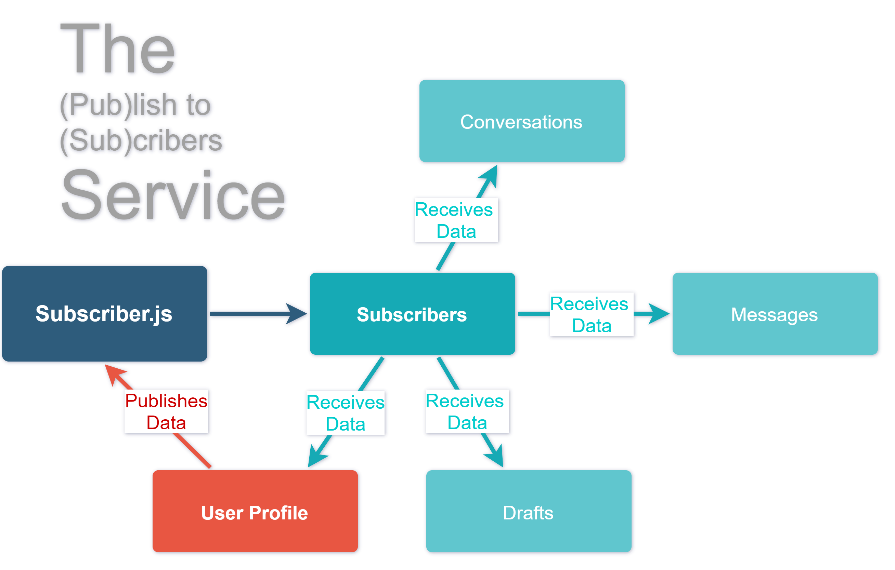
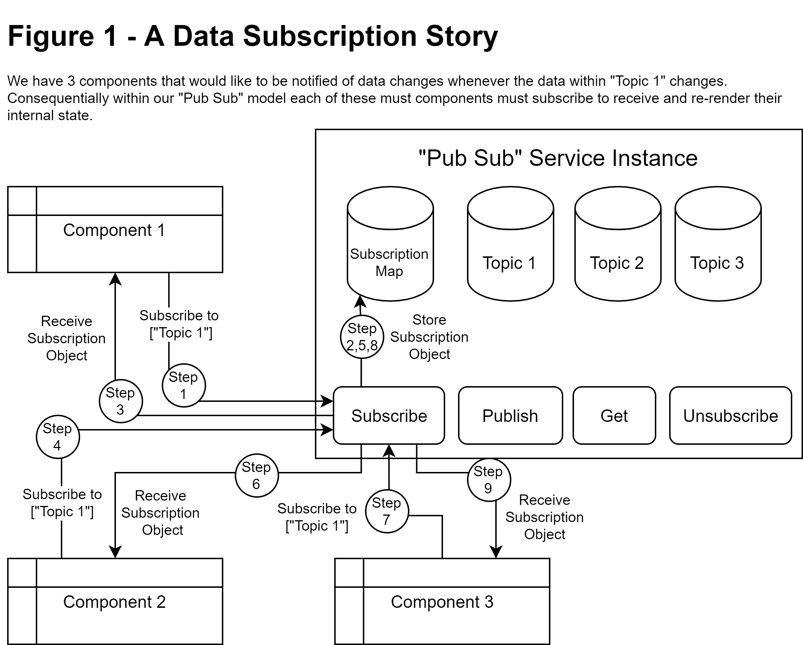
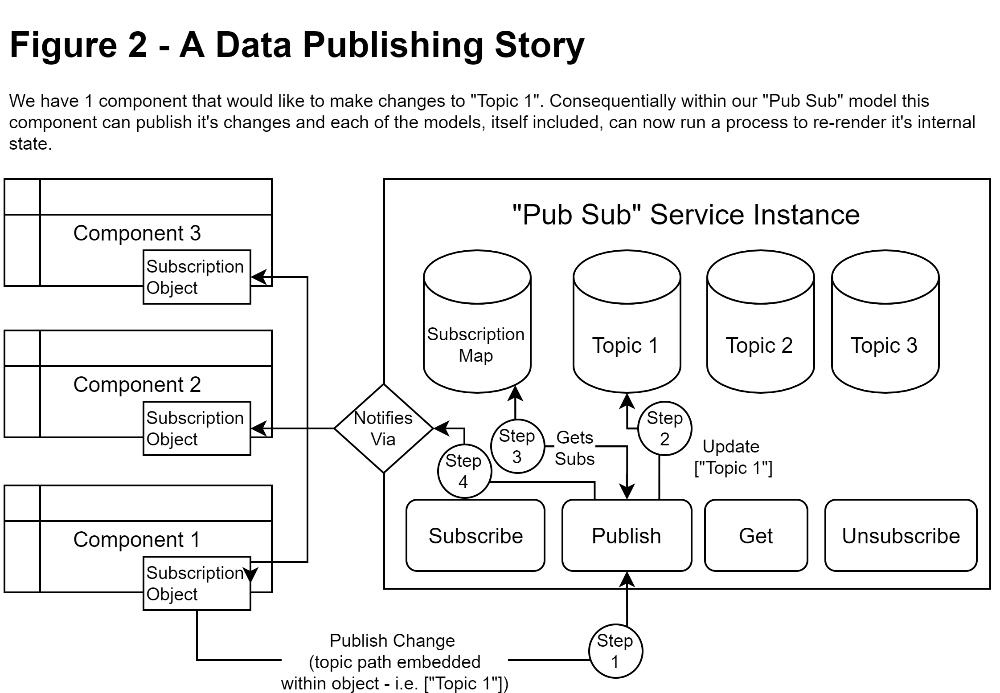
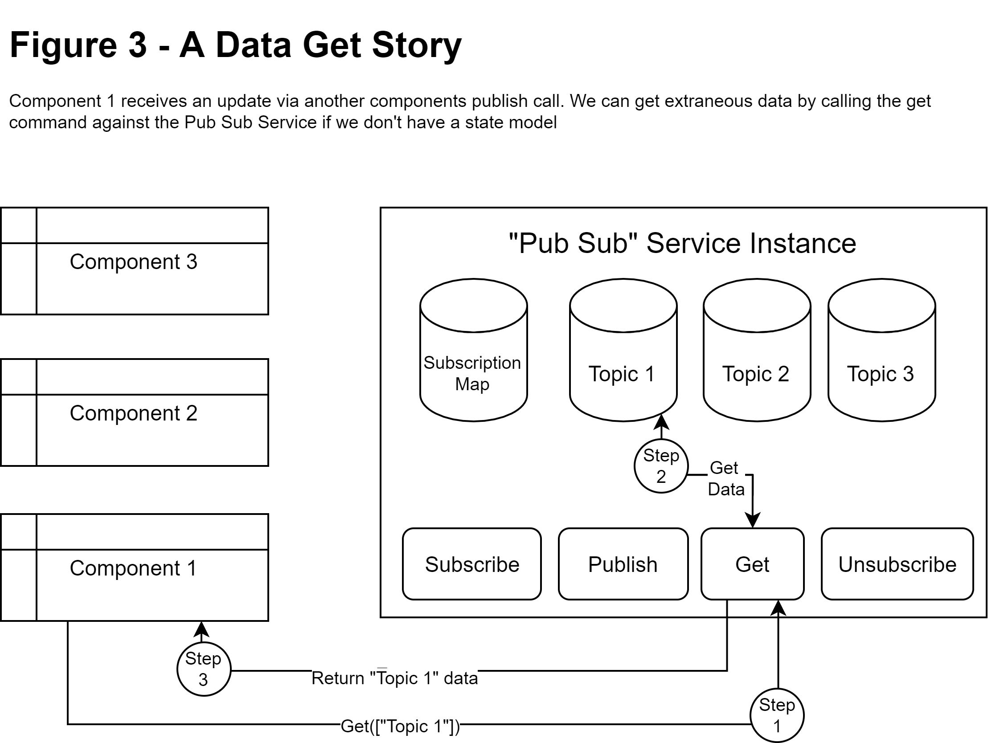
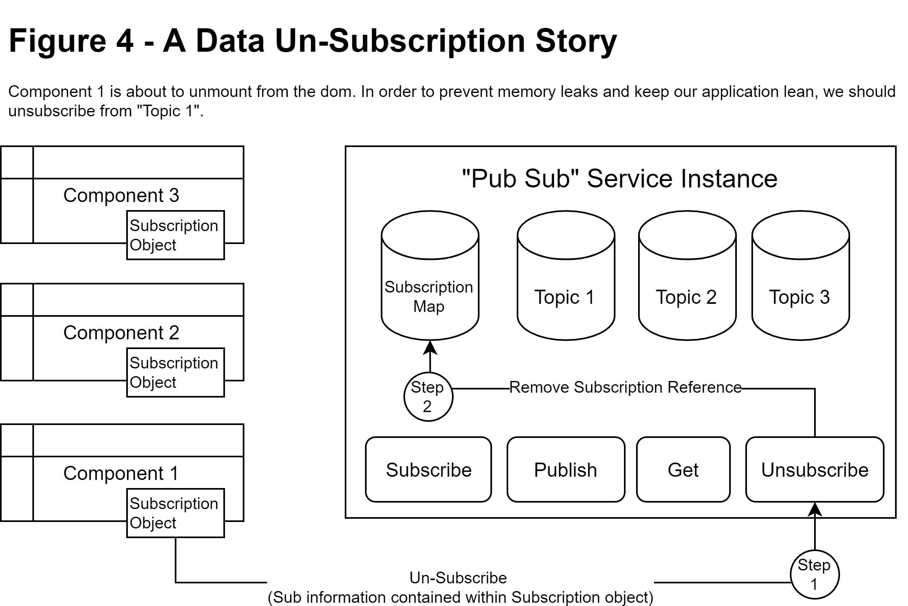
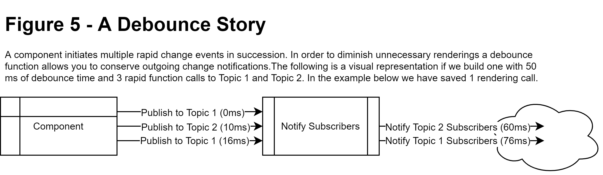

# Writing a Publish & Subscription (PubSub) service from scratch 

## Overview

The Publish & Subscribe pattern is generally defined as a software architecture paradigm where senders of messages, called publishers, send their messages to an intermediary broker which utilizes any form of classification to notify receivers, called subscribers, of those messages. The receivers who have subscribed to those classifications do not need to know who emitted the initial message, but rather only that the message falls under the classification that they have subscribed to. There are several libraries which implement Pub Sub models across a wide variety of domains, and even for the article written here, there are libraries that solve the same problem that can be applied to UI and State management such as mroderick’s PubSubJS. There’s SignalR, with which you can natively configure a Pub Sub model within asp.NET. JMS within Java. Google even has Pub/Sub Client libraries that you can implement within C++, C#, Go, Java, Node.js, PHP, Python, and Ruby. 

So why should you write your own Pub Sub model? Importantly, being able to write a pub sub service from scratch in different environments across different languages can allow you to maintain a sensible software architecture for clients within a tight security and package approval process where you may not be granted the opportunity to use your favorite Pub Sub library or API. In some legacy code environments, you may have requirements that don’t allow you to use the syntax due to it’s un-availability within that version. Additionally, many frontend frameworks make it slightly easier to build tightly coupled components which quickly become overly complex if you manage to pass data between parents and children. A quick reminder of the structure of a Pub Sub service and how it works internally, can provide you insight into the types of problems that you can solve. In this article we will be going over the implementation of a Pub Sub service within the paradigm of UI & State Management.




We chose UI & State management because it still illustrates the purpose and scope of a Pub Sub service implementation without involving the complicated cross platform elements that some many network based Pub Sub models employ. Some frontend frameworks, especially those that are unopinionated, leave it up to the developer to choose their own method of handling complex UI transformations from client data model changes. A "PubSub" service, within this context, is a simple and efficient way to share client data model updates among many components, without utilizing unnecessary resources. These resources in traditional models are usually spent creating observers or setters to underlying which can be an expensive process. 

In a nutshell, a Pub Sub service allows a component to publish changes so that other components may be notified and allowed to perform some action related to it's purpose.

## Features

1) Publish, Subscribe, Un-Subscribe, Get Topics
2) Call Debouncing (Conserving procedural calls)
3) Group Chat Communication Demonstration

## What You need

* Intermediate knowledge of JavaScript
* Basic knowledge of Object-Oriented Design (modules,classes)
* Basic knowledge of HTML

## Technology Stack

* HTML
* JavaScript

This article will refrain from using any specific frontend framework to remain agnostic to your desired project or business requirements

## Software Architecture 

### Official Terminology
First, some terms to consider while building a simple pub-sub model:

#### Topics
Your "single source of truth". A series of data which is held in a single local client area to be subscribed to. In this simple Pub Sub service, our "topics" will essentially just be a multi-dimensional JSON store.

#### Subscribe
An action which, when called, stores the data's access path and a subscription object which contains a callback reference into a Subscription array. Informally, the act of subscribing means that you would like to be informed when there’s an update to the information subscribed to.



#### Publish
An action which, when called, notifies others who have subscribed to a topics path that a change has been made. The Subscribers can then do what they need to in order to update their local views. Informally, the act of publishing means that you have an update that you would like to share with other subscribers of the topic.



#### Get
An action which, when called, retrieves the topic from the Pub Sub service repository. An equivalent action can be performed by accessing the topics member variable. Informally, the act of getting means that you want to receive the information, but not necessarily to subscribe to the updates.



#### Un-Subscribe
An action which, when called, removes the data's callback reference from the Subscriber object in order to prevent memory leakages. Informally, the act of un-subscribing means that you are telling the service that you will no longer b available to receive updates.



#### Debounce
A class which, when instantiated and called, allows you to delay the final execution of a function call until some delayed period when calls stop being made. This is useful when you have multiple different datasets mutating a published state in rapid succession. It allows you to delay sending a message to the subscriber until some specified time interval after.



### Un-Official Terminology

These are other terms that I will use within this context when describing certain features of this Pub Sub

#### Pluck
A function which, when called, follows the path to the subscribed object in order to retrieve the source data.

[Skip to Pub-Sub portion](#Step-3---Writing-our-Subscriber.js)

## Client Story

In a request to build a chat system, a client has requested that this system be able to do the following tasks:

1) Keep track of the messagers name.
2) Keep track of the messagers conversation history.
3) Be able to change the messagers name at any time.
4) Have the messagers name be updated within the conversation history.
5) Keep track of the date and time of each message.

## Design Notes

Notice that each of these items mentioned within the client story, make no mention of an architected approach towards solving the problem. But we have 2 main domains of data here:

1) Users
2) Messages

A conversation, even though it is described, is not necessarily a saved entity. Rather we can illustrate it as a view generated by code, which reduces data redundancy. Each of the Messagers are essentially users, with the caveat being that the currently authenticated user physically using the application is the messager. Rather than creating a dataset which models the business logic directly, I've decided to split the information into more atomic elements which can be virtually joined in order to meet the business requirements.

## Business Use Cases

In some business environments, it may be difficult or impossible to retrieve client approval for adding your favorite external libraries. Being able to write your own Pub Sub services while using native rendering techniques can provide an edge for attracting and maintaining clients in security tight environments.

## Where's the code & full guide?

The working code and demo for this article can be found [here](https://github.com/ips-yes/pub-sub)

## What's next?

This model can be expanded to do MANY more things that aren't directly covered in the source guide like:

* Scoped data changes within subscriptions.
* Partial updates data updates, reducing data size
* GIT style change handling (to multi-component merge conflicts)

## Guide

[Skip to Pub-Sub portion](#Step-3---Writing-our-Subscriber.js)

### Step 1 - Making an Interface

Let's build a simple interface to show the users name, conversations and messages. We will be adding the initialization function which acts similarly to front-end frameworks mounting operators. Where initial rendering occurs and future updates to the subscribed topics will re-render ui components. Realistically, the main difference here would be that we are essentially remounting the component every time, whereas many front-end frameworks maintain a shadow dom of some sort and apply only necessary updates.
```html
<body onload="main()">
    <div class="split-1">
        <div class="conversations">
            <div class="header">Conversations</div>
            <div id="conversation-list">
                <!-- Will hold available conversations -->
            </div>
        </div>
    </div>
    <div class="split-3">
        <div class="user">
            <div class="header">User Info</div>
            <div class="d-inline-block">
                <label>User ID</label><br>
                <input id="user-id" class="font-control" type="text" disabled>
            </div>
            <div class="d-inline-block">
                <label>Name</label><br/>
                <input id="edit-user-name" class="font-control" type="text" placeholder="enter your name"/>
            </div>
        </div>
        <div class="chat">
            <div id="messages">
                <!-- Will hold filtered messages -->
            </div>
        </div>
    </div>
    <div class="draft-wrapper">
        <div class="draft">
            <div class="split-1">
                <label>To</label><br/>
                <select id="compose-to" class="font-control" multiple></select><br/>
            </div>
            <div class="split-3">
                <label>Message</label><br/>
                <textarea id="compose-message" class="font-control" placeholder="enter a message"></textarea>
            </div>
        </div>
    </div>
</body>
```

### Step 2 - Setting up some mock data
For the time being, we will generate some mock data based on our design notes from the client story.
```javascript
let topics = {
    authenticated:{
        id:1,
        view:{
            conversation:[1,2,3]
        }
    },
    users:[
        { id:1, name: "Ryan" },
        { id:2, name: "Sarah" },
        { id:3, name: "Emma" }
    ],
    messages:[
        {   sent:"2021-06-02T11:50:00",
            from:1, to:[2], message:"I'd like to learn a bit more about pub sub models" },
        {   sent:"2021-06-02T11:52:00",
            from:2, to:[1], message:"No problem, start a conversation with Emma and I and we can discuss it's benefits" },
        {   sent:"2021-06-02T12:10:00",
            from:1, to:[2,3], message:"Hey, can anyone tell me what benefits a pubsub model has?" },
        {   sent:"2021-06-02T12:12:00",
            from:2, to:[1,3], message:"It allows one-way binding from a single publishing component to the central repository for other components to see" },
        {   sent:"2021-06-02T12:13:00",
            from:3, to:[1,2], message:"It also simplifies and removes the need for cross component communication" }
    ]
}
```
### Step 3 - Writing our Subscriber.js

As defined before, we have a couple of features that we need to build into our subscription model in order for it to be usable everywhere with just a single subscription call.

#### Step 3a - The Subscriber Class

The Subscriber class provides a repository for your "single source of truth" as well as some helper functions to build the subscriptions.

```javascript
class Subscriber {
    constructor(topics){
        this.topic=topics || {}; // Data Sources
        this.subscriptions={};  // Subscription map
    }
    subscribe(path,callback){
        // register the subscriber to a path of data
    }
    unsubscribe(path,uniqId){
        // remove the subscribtion to a path of data
    }
    get(path){
        // get data at some path
    }
    publish(path,data){
        // mutate and notify subscribers of a change
    }
}
export default Subscriber
```

#### Step 3b - The Subscribe & Un-Subscribe Function
Our first parameter *path* can be used to represent the topic, or the path to the topic that the component would like to subscribe to. We can store this subscriber path directly as a key within our subscriptions member variable.

Our second parameter *callback* can be used to notify other subscribed components of any changes at this location. We can store this within a self contained object in order to simplify any communication from other publishers.
```javascript
class Subscriber{
    //...
    subscribe(path,callback){

//storing our subscription path allows us to define an easy mechanism for notifying multiple subscribers regarding changes to a path of information

        let subpath = path.join("-");

//storing a unique key allows the Subscriber to access each callback uniquely without interference from later unsubscribes.

        let uniqId = this.uuidv4(); 

//storing metadata and accessor functions in the subscription object means that we can pass this reference to the subscribing function as well as to the subscriptions member without having to remember any path information. We can embed our unsubscribe and publish logic directly passing only the absolutely necessary information.

        var subscription = {
            id:uniqId,
            callback:callback,
            unsubscribe:()=>{
                this.unsubscribe(subpath,uniqId);
            },
            publish:(data)=>{
                this.publish(path,data);
            },
            get:()=>{
                return this.pluck(this.topic,path)
            }
        } 

//here we do a check to see if the path already exists within the subscriptions member variable upserting a subscription into the subscriptions member variable when necessary.

        if(subpath in this.subscriptions){
            this.subscriptions[subpath].push(subscription);
        }
        else{
            this.subscriptions[subpath]=[subscription];
        }

//finally we pass our subscription object back to the subscribing call to allow for publishing (to mutate and notify other subscribers) or unsubscribing (to prevent memory leaks in applications that potentially mount/unmount)

        return subscription;
    }
}

```

"What is the uuidv4 function?"

Just a helper function to generate a unique key for this subscription. We'll need to add the code in order to generate it
```javascript
class Subscriber {
    //...
    uuidv4() {
        return 'xxxxxxxx-xxxx-4xxx-yxxx-xxxxxxxxxxxx'.replace(/[xy]/g, function(c) {
            var r = Math.random() * 16 | 0, v = c == 'x' ? r : (r & 0x3 | 0x8);
            return v.toString(16);
        });
    }
}
```

#### Step 3c - The Publish Function
Our first parameter *path* represents the path to the data we are subscribed to. If you look at the subscribe function, you will notice that the object returned has a publish function as well with the path already embedded to simplify the publish call from the perspective of the subscribing component.

Our second parameter *data* represents the new state of the data at the path subscribed. This is what would be modified within the topic specified in the first parameter.

```javascript
class Subscriber {
    //...
    publish(path,data){

//assign only the mutated properties to the underlying data.

        Object.assign(this.pluck(this.topic,path),data);

//This portion notifies other subscribers of changes to the underlying data

        this.subscriptions[path.join("-")].forEach((subscription)=>{
            subscription.callback(this.pluck(this.topic,path),subscription);
        });
    }
}
```
"pluck? where did that come from?"

It has to be written! To guarantee that the data we are accessing is from the "single source of truth" and that we aren't making or passing a copy at any point, we've wrapped a recursive function call, utilizing the topic member and the path to the subscribed data. The pluck function simply keeps traversing the path provided until there are no more items to traverse. You'll notice within other pub sub libraries that the path is simply a string accessor that get's evaluated. I prefer to build a pluck function that utilizes the accessor as an array simply because I've built another recursive library that utilizes path's and constructor patterns to traverse multi-dimensional data. By maintaining the ability to type the data appropriately, I'm able to use constructor types that noramlly would be lost when converted to a string.

```javascript
class Subscriber {
    //...
    pluck(data,path,set=null){
        if(path.length>1){
            return this.pluck( data[path[0]] , path.slice(1,path.length) , set );
        }
        else{
            if(path.length==0){
                return data;
            }
            else{
                if(set==null){
                    return data[path[0]];
                }
                else{
                    data[path[0]]=set;
                    return data[path[0]];
                }
            }
        }
    }
}
```

#### Step 3d - The Un-Subscribe Function
In applications which have complex mounting behaviors, an unsubscribe function is necessary to make sure that we aren't continuing to execute callbacks to old and unused subscribtions. Otherwise, we may encounter memory leaks associated orphaned function calls.
```javascript
class Subscriber {
    unsubscribe(subpath,uniqId){

//Here we are finding the current index of the subscription with the uniqId to be unsubscribed 
        let removeAt=this.subscriptions[subpath].findIndex((subscription)=>{
            return subscription.id === uniqId;
        });

//Performing a check to see whether there are exactly 1 subscription, in which case we can remove the whole subscription path, or just splice the subscription itself

        if(this.subscriptions[subpath].length == 1 ){
            removeAt >=0 ? delete this.subscriptions[subpath] : 0 ; 
        }
        else{
            removeAt >=0 ? this.subscriptions[subpath].splice(removeAt,1) : 0 ;
        }  
    }
} 
```

#### Step 3e - Finalizing Subscriber.js
In order to use this class as a module within other HTML/JavaScript projects we will just need to append the following syntax
```javascript
export default Subscriber
```

### Step 4 - Writing our Debouncer.js (optional)
Imagine that we have multiple components which publish changes in rapid succession. Do we actually want our components to re-render over and over again? Or should we implement a heuristic function to wait some time interval before going ahead and performing the subscriber callbacks? We can write a simple Debounce class in order to efficiently solve this problem without consuming an unnecessary amount of resources.

Here is our debouncer.js file
```javascript
class Debouncer {
    constructor(delay){
        this.callStack=0;       //a integer stack to keep track of the number of times called
        this.delay=delay || 20; //the time to wait before decrementing the callstack (i.e. the span of time to debounce)
    }
    debounce(logic){
        this.callStack+=1;      //increments the stack
        setTimeout(()=>{
            this.callStack-=1;  //decrements the stack
            this.callStack==0 && logic() //performs user logic if stack reaches zero. 
        },this.delay);
    }
}
export default Debouncer;
```

Here are the changes to Subscriber.subscribe to add the debouncer we've just created
```javascript
import Debouncer from Debouncer;
class Subscriber {
    subscribe(path,callback){
        //...
        if(subpath in this.subscriptions){
            this.subscriptions[subpath].push(subscription);
        }
        else{
            this.subscriptions[subpath]=[subscription];
            this.subscriptions[subpath].debouncer = new Debouncer(); //new debouncer for
        }
    }
}
```

This problem that we have just solved repeatedly crops up across multiple seemingly unique problem domains. As evidence, consider the following example:

I have a quick search feature which checks the onkeyup event every tine a user types a character. The feature goes ahead and makes a network request to find the available options. 

Immediately, we can see that if the user types 12 characters and then stops, a naive implementation of this feature will perform the network request, any filter logic, and/or rendering 12 times, slowing down the ux tremendously despite the fact that in reality, many users only require typeahead, functionality after a brief pause in typing as a suggestive action.

### Step 5 - Wiring up our UI

```javascript
import Subscriber from './services/subscriber.js';
import Debouncer from './services/debouncer.js';

//...

/* Instantiate Pub Sub Service */
const PubSubService = new Subscriber(topics);

/* Startup Functions */
function main(){

    /* Initial Binds */
    bindTo();
    bindProfile();
    bindMessages();
    bindConversations();

    /* Subscriptions */
    let authenticationSubscription = PubSubService.subscribe(["authenticated"],(data)=>{
        bindTo();
        bindProfile();
        bindMessages();
        bindConversations();
    }); //Subscribe if "authenticated" topic changes
    let userSubscription = PubSubService.subscribe(["users"],(data)=>{
        bindTo();
        bindProfile();
        bindMessages();
        bindConversations();
    }); //Subscribe if "users" topic changes
    let messageSubscription = PubSubService.subscribe(["messages"],(data)=>{
        bindMessages();
        bindConversations();
    }); //Subscribe if "messages" topic changes
    
    /* Subscriber Listeners */
    //when compose to select box changes
    document.getElementById("compose-to").addEventListener("change",()=>{
        let conversationFilter = [ authenticationSubscription.get().id].concat(Array.prototype.slice.call(document.querySelectorAll('#compose-to option:checked'),0).map((v,i,a)=> { 
            return parseInt(v.value); 
        })).sort((a,b)=>a-b)
        console.log(conversationFilter);
        authenticationSubscription.publish({ view:{conversation:conversationFilter }});
    })

    //when name field changes
    document.getElementById("edit-user-name").addEventListener("change",(e)=>{
        let currentUserID = authenticationSubscription.get().id;
        let newUsersList = userSubscription.get().map((user)=>{
            user.name = user.id===currentUserID ? e.target.value : user.name;
            return user;
        });
        userSubscription.publish(newUsersList);
    });

    //when message is sent
    document.getElementById("send-message").addEventListener("click",(e)=>{
        let authProfile = authenticationSubscription.get();
        let newMessage = {
            sent: (new Date()).toJSON(), 
            from: authProfile.id,
            to: authProfile.view.conversation.filter(id=>id!==authProfile.id),
            message: document.getElementById("compose-message").value
        };
        let messages = messageSubscription.get();
        messages.push(newMessage);
        messageSubscription.publish(messages);
    });


    /* UI Listeners */
    affixChatHeight();

    window.onresize=()=>{
        resizeDebouncer.debounce(()=>{
            affixChatHeight();
        })
    }
}

/* Binding/Rendering functions */
function bindTo(){
    let authProfile = PubSubService.get(["authenticated"]);
    let usersList = PubSubService.get(["users"]);
    document.getElementById("compose-to").innerHTML = usersList.map(user=>user.id !== authProfile.id?`<option value="${user.id}" ${authProfile.view.conversation.indexOf(user.id)>=0?"selected":""}>${user.name}</option>`:"").join("");;
}
function bindProfile(){
    let authProfile = PubSubService.get(["authenticated"]);
    let userInformation = PubSubService.get(["users"]).find((user)=>user.id===authProfile.id);
    document.getElementById("user-id").value = userInformation.id;
    document.getElementById("edit-user-name").value = userInformation.name;
}
function bindMessages(){
    let authProfile = PubSubService.get(["authenticated"]);
    let usersList = PubSubService.get(["users"]);
    let messageList = PubSubService.get(["messages"]);
    document.getElementById("messages").innerHTML = messageList.filter((message)=>{
        let groupKey = [message.from].concat(message.to).sort((a,b)=>{
            return a-b;
        }).join("-");
        return groupKey === authProfile.view.conversation.join("-");
    }).map((message)=>{
        return `
            <div class="message ${message.from===authProfile.id?"outgoing":"incoming"}">
                <div class="contents">
                    <div class="header">${usersList.find((user)=>user.id===message.from).name} - <small>${(new Date(message.sent)).toLocaleDateString()} ${(new Date(message.sent)).toLocaleTimeString()}</small></div>
                    ${message.message}
                </div>
            </div>`; 
    }).join("");
}
function bindConversations(){
    let authProfile = PubSubService.get(["authenticated"]);
    let userDict = PubSubService.get(["users"]).reduce((accumulator,user)=>{
        accumulator[user.id]=user
        return accumulator;
    },{});
    let messageGroups = PubSubService.get(["messages"]).reduce((accumulator,message)=>{
        let chatKey = [message.from].concat(message.to).sort((a,b)=>a-b).join("-");
        if(!(chatKey in accumulator)){
            accumulator[chatKey] = { 
                messages: 0,
                members: [message.from].concat(message.to)
            };
        }
        accumulator[chatKey].messages+=1;
        return accumulator;
    },{});
    document.getElementById("conversation-list").innerHTML = Object.entries(messageGroups).map((messageGroupEntry)=>{
        return `
            <div class="conversation" onclick="setConversation([${messageGroupEntry[1].members.join(",")}])">
                <span class="conversation-names">
                    ${messageGroupEntry[1].members.filter(id=>id!==authProfile.id).map((id)=>{
                        return userDict[id].name
                    }).join(", ")} 
                </span>
                <span class="conversation-messages">${messageGroupEntry[1].messages}</span>
            </div>`
    }).join("")
}

/* Setter functions */
function setConversation(ids){
    PubSubService.publish(["authenticated"],{view:{conversation:ids}});
}

let resizeDebouncer = new Debouncer();
function affixChatHeight(){
    document.querySelector(".chat").style="max-height:"+(window.innerHeight-230)+"px";
}

window.setConversation=setConversation; //accessible via window
window.main=main;                       //accessible via window
```
### Step 6 - Styling our UI

The rest of the styling decisions are purely aesthetic and were added just to provide a nice looking demo.

```css
* {
    font-family:Arial, Helvetica, sans-serif;
}
label {
    font-size:11px;
}
.header {
    width:100%;
    text-align:left;
    font-weight:600;
    margin-bottom:3px;
}

/* User information controls */
.user {
    margin-bottom:1rem;
    padding:.5rem;
    border-bottom:1px solid lightgray;
}

/* Conversation controls */
.conversations {
    padding:.5rem;
}
#conversation-list{
    margin-top:.5rem;
}
.conversation {
    font-size:.8rem;
    padding:.5rem;
    margin-left:-.5rem;
    border-bottom:.5px solid lightgray;
    color:slategray;
    cursor:pointer;
}
.conversation-names {
    font-size:.7rem;
}
.conversation-messages {
    float:right;
}
.conversation:hover {
    background-color:gray;
    color:white;
}
.conversation:last-child {
    border-bottom:none;
}

/* Draft Controls */
.draft-wrapper{
    position:fixed;
    width:74%;
    bottom:0;
    right:0;
    border-top:1px solid lightgray;
    background-color:white;
}
.draft {
    padding:.5rem;
}
#compose-to {
    height:50px;
    width:100%;
    font-size:.65rem;
}
#compose-message {
    width:100%;
    height:45px;
    resize:none;
}

/* Message Controls */
.chat {
    overflow-y:auto;
}
.message {
    font-size:.8rem;
    display:block;
}
.message .contents {
    padding:.5rem;
    margin:.25rem;
    border-radius:5px;
    color:white;
    display:inline-block;
}
.incoming {
    text-align:left;
}
.incoming .contents {
    background-color:slategray;
}
.outgoing {
    text-align:right;
}
.outgoing .contents {
    background-color:steelblue;
}

/* Display utilities */
.split {
    display:inline-block;
    width:49%;
}
.split-1 {
    vertical-align:top;
    display:inline-block;
    width:25%;
}
.split-3 {
    vertical-align:top;
    display:inline-block;
    width:74%;
}
.d-inline-block{
    display:inline-block;
}
.font-control{
    border:.5px solid lightgray;
    font-size:.75rem;
}
```
## Additional Notes

### Frontend Frameworks (i.e. angular, react, riot)

The following comments are recommendations based on prior experience implementing "Pub Sub" models:

1) Store data subscriptions within the component models that handle the business logic of an application.

2) Subscriptions should be created within the mount lifecycle and saved within the component state for re-use later on with any bound event listeners from your ui components. 

3) Decoupling generic layout components from wrapping business logic is good practice if you plan on re-using those components across your applications business domains. By creating generic components and wrapping them up in business logic, you can bootstrap the reusability or your components and generate UI Entity Frameworks that work for your development teams.

### Close to Standards

This article is purposefully written to be agnostic to many frameworks available today. The code written here utilizes basic HTML5, CSS, ES5 & ES6 JavaScript with this guide being written in Markdown (.md)